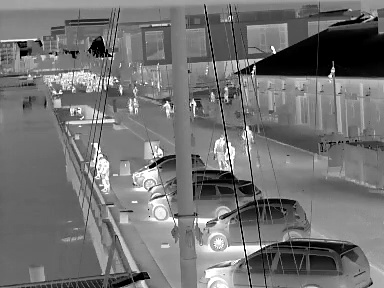

# Harborfront video anomaly detection

A framework to set out to aid in the generation of video anomaly detection datasets based on object annotations.

## Links

[Long-term Thermal Drift Dataset](https://www.kaggle.com/datasets/ivannikolov/longterm-thermal-drift-dataset)

[Thermal Mannquin Fall Image Dataset](https://www.kaggle.com/datasets/ivannikolov/thermal-mannequin-fall-image-dataset)

[Harborfront object annotations](https://drive.google.com/file/d/17uUsUSJ5npWFwvoK03HUbOsYc0RDh4W4/view?usp=drive_link)

[Harborfront YOLOv5](https://drive.google.com/file/d/1QqoOjaAd2bsfgt5JbPVZKiSwfnrVK0Fz/view?usp=drive_link)

## Configuration

```
cp config_template.yaml config.yaml
```
config.yaml is git-ignored and modified to your paths


## Data preparation

```
python -m src.detection.inference
python -m src.data.object_annotations.appearance
python -m src.data.object_annotations.fast_motion
python -m src.data.object_annotations.near_edge
python -m src.data.object_annotations.high_density
python -m src.data.object_annotations.tampering
python -m src.data.object_annotations.train
```

## Methods

[MNAD](https://github.com/cvlab-yonsei/MNAD)

[SSMTL](https://github.com/lilygeorgescu/AED-SSMTL)


## Sample image

